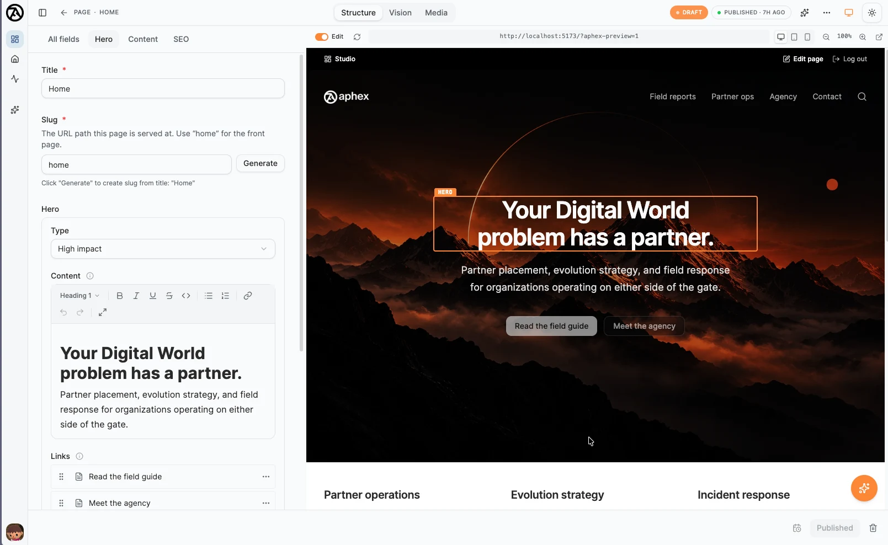

<div align="center">
  
  <h1>Content infrastructure for the modern web</h1>
  <p>
    <strong>An open-source CMS built on and for SvelteKit, with content stored in your own database.</strong>
  </p>
  <p>
    Developers get schema-as-code and typed APIs. Editors get a polished Studio.<br>
    Nobody gets an invoice for reading their own content.
  </p>

  <p>
    <a href="https://getaphex.com"><strong>Website</strong></a> ·
    <a href="https://getaphex.com/admin"><strong>Try the demo</strong></a> ·
    <a href="https://docs.getaphex.com"><strong>Documentation</strong></a> ·
    <a href="https://docs.getaphex.com/getting-started"><strong>Get started</strong></a>
  </p>

  <p>
    <a href="https://github.com/IcelandicIcecream/aphex/actions/workflows/ci.yml"></a>
    <a href="https://www.npmjs.com/package/@aphexcms/cms-core"></a>
    <a href="https://www.npmjs.com/package/@aphexcms/cms-core"></a>
    <a href="./LICENSE"></a>
  </p>
</div>



## Start in under a minute

```bash
pnpm create aphex my-app
cd my-app
pnpm install
pnpm dev
```

Open **[localhost:5173/admin](http://localhost:5173/admin)**. The first user to sign up
becomes super admin.

A new project starts with SQLite and provisions its own schema on first boot. There is no
database service to start and no migration command to run. Move to PostgreSQL or Turso by
changing the adapter, without redesigning your content model.

## One definition. Multiple interfaces.

Define a TypeScript content schema once:

```ts
import { defineType } from '@aphexcms/cms-core';

export const menuItem = defineType({
	type: 'document',
	name: 'menuItem',
	title: 'Menu Item',
	fields: [
		{ name: 'name', type: 'string', title: 'Name' },
		{ name: 'price', type: 'number', title: 'Price' },
		{ name: 'image', type: 'image', title: 'Image' }
	]
});
```

Aphex turns it into:

| Interface     | What you get                                                                  |
| ------------- | ----------------------------------------------------------------------------- |
| **Local API** | Fully typed content queries inside your SvelteKit server, with no network hop |
| **HTTP API**  | Zod-validated endpoints ready for any frontend or service                     |
| **GraphQL**   | A generated schema shaped by your content model                               |
| **Studio**    | A complete editing interface with validation, drafts, history, and publishing |
| **MCP**       | Governed tools for AI clients and coding agents                               |

## Built for the people who run the site

- **Business-shaped content**: clear forms built around concepts your team already knows.
- **Visual editing**: live SvelteKit previews with stega-encoded click-to-edit targets.
- **Publishing with intent**: drafts, auto-save, scheduled publishing, and rolling history.
- **Rich content without a black box**: Portable Text backed by TipTap, with custom blocks,
  inline objects, marks, and annotations.
- **A Studio that travels with the app**: the admin and website deploy together instead of
  becoming two systems joined by webhooks and hope.

## Bring the stack you already run

Aphex uses explicit adapters for infrastructure, so changing providers does not require
changing your schemas or editor experience.

| Concern        | First-party support                                   |
| -------------- | ----------------------------------------------------- |
| Database       | PostgreSQL, PGlite, SQLite, Turso/libSQL              |
| Storage        | Local filesystem, S3, Cloudflare R2, MinIO            |
| Authentication | Better Auth                                           |
| Email          | SMTP/Nodemailer, Resend                               |
| AI             | OpenAI-compatible providers, MCP for external clients |

The core stays database-agnostic behind ports and adapters. PostgreSQL and SQLite run the
same cross-dialect conformance suite and are peers, not separate product tiers.

## Production foundations included

- Organization tenancy, parent/child hierarchy, capability RBAC, field-level access, and
  PostgreSQL row-level security
- Append-only domain events, a transactional outbox, and database-backed jobs with leases,
  retries, exponential backoff, and dead-lettering
- Local and S3-compatible asset storage, private asset delivery, image variants, and direct
  uploads
- Typed plugins that can extend schemas, Studio UI, protected routes, permissions, agent
  tools, event consumers, and job handlers without forking the core
- An in-Studio assistant and Streamable HTTP MCP server grounded in the same schemas,
  permissions, and content

## Packages

| Package                        | Purpose                                                  |
| ------------------------------ | -------------------------------------------------------- |
| `@aphexcms/cms-core`           | Content engine, Studio, API handlers, GraphQL, and MCP   |
| `@aphexcms/postgresql-adapter` | PostgreSQL and PGlite database adapters                  |
| `@aphexcms/sqlite-adapter`     | SQLite and Turso/libSQL database adapters                |
| `@aphexcms/storage-s3`         | S3-compatible object storage                             |
| `@aphexcms/nodemailer-adapter` | SMTP email, including a Mailpit development helper       |
| `@aphexcms/resend-adapter`     | Resend email for production                              |
| `@aphexcms/ai-openai`          | OpenAI-compatible model backend for the Studio assistant |
| `@aphexcms/visual-editing`     | Live preview, stega helpers, and click-to-edit overlays  |
| `@aphexcms/plugin-forms`       | Editor-composed forms, submissions, and notifications    |
| `@aphexcms/plugin-seo`         | SEO fields, previews, and metadata generation            |
| `@aphexcms/ui`                 | Shared shadcn-svelte component library                   |
| `create-aphex`                 | Project scaffolder used by `pnpm create aphex`           |

## Learn more

- **[Getting started](https://docs.getaphex.com/getting-started)**: create and configure your first project
- **[Schemas](https://docs.getaphex.com/schemas)**: fields, validation, hooks, and conditional behavior
- **[APIs](https://docs.getaphex.com/local-api)**: Local API, HTTP, GraphQL, and MCP
- **[Visual editing](https://docs.getaphex.com/visual-editing)**: live previews and click-to-edit
- **[Events and jobs](https://docs.getaphex.com/events-and-jobs)**: durable reactions and scheduled work
- **[Deployment](https://docs.getaphex.com/deployment)**: Docker, Railway, Render, and Coolify/Dokploy

The docs also publish **[llms.txt](https://docs.getaphex.com/llms.txt)** and per-page Markdown
for AI clients.

## Open source. The whole thing.

Aphex is fully [MIT licensed](./LICENSE), from Studio to server, not just an open-source
editing shell. The editor, content engine, APIs, adapters, and job system are free to fork,
extend, and deploy for every client, team, and website.

Contributions are welcome. Start with the
**[contributing guide](https://docs.getaphex.com/contributing)** for development setup,
architecture, code standards, and the release flow. Working in this repository with an AI
agent? [`CLAUDE.md`](./CLAUDE.md) documents the architectural boundaries and common traps.

Development is supported by
**[White Raven Brands](https://github.com/whiteravenbrands)** and community sponsors.
You can **[sponsor Aphex](https://github.com/sponsors/IcelandicIcecream)** to support its
continued development.

---

<div align="center">
  <strong>Your database. Your infrastructure. Your content.</strong><br><br>
  <a href="https://github.com/IcelandicIcecream/aphex/issues">Report an issue</a> ·
  <a href="https://github.com/IcelandicIcecream/aphex/discussions">Join the discussion</a>
</div>
